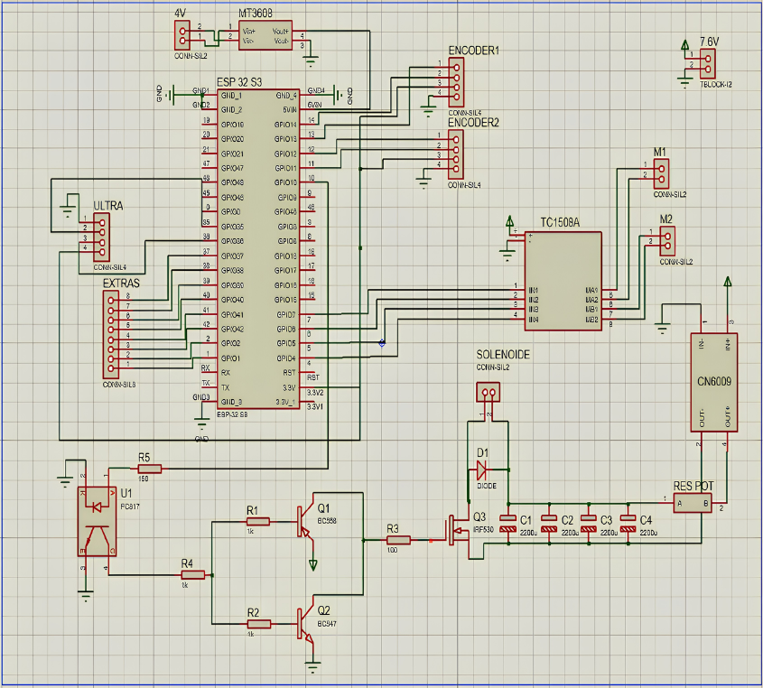

# 🤖 PPEX (GRUPO 1) - Robô de Futebol "Bot-afogo" (ESP32-S3)

[](https://docs.espressif.com/projects/esp-idf/en/latest/esp32s3/)
[](https://en.wikipedia.org/wiki/C_(programming_language))
[](https://www.freertos.org/)
[](https://mynewt.apache.org/latest/network/)

Repositório dedicado ao firmware, painel de controle e documentação do **Bot-afogo**, um robô móvel com sistema de chute desenvolvido para a disciplina de **Planejamento e Prática de Experimentos (PPEX)** do CEFET-MG. 

O projeto evoluiu de uma base estritamente autônoma para um sistema de controle de malha fechada via **Bluetooth Low Energy (BLE)**, com telemetria bidirecional em tempo real e um *Dashboard Web* para pilotagem.

## 🚀 Principais Funcionalidades

* **Controle de Malha Fechada (PID):** Controle preciso de velocidade utilizando a leitura dos encoders nas rodas. O sistema conta com rampas de aceleração (Soft-start/stop) para evitar picos de corrente nos motores e garantir estabilidade mecânica.
* **Telemetria em Tempo Real (HUD):** O ESP32 envia dados constantes a 20Hz contendo a leitura do radar ultrassônico (desvio de obstáculos), a velocidade real (cm/s) e a porcentagem de bateria.
* **Monitoramento Inteligente de Bateria:** Leitura de tensão via divisor resistivo (21k/9.9k) utilizando a biblioteca `esp_adc`. Possui um **Filtro Passa-Baixa (Moving Average)** e um detector de inércia que ignora o *voltage sag* (queda de tensão) causado pelo consumo dos motores, exibindo uma porcentagem real e estável.
* **Controle Remoto via Web Bluetooth:** Interface gráfica completa (HTML/CSS/JS) responsiva e otimizada para smartphones em modo *landscape*. A comunicação é feita nativamente pelo navegador web (Web Bluetooth API), eliminando a necessidade de instalação de aplicativos nativos.
* **Sistema de Remate (Chute):** Acionamento de uma solenoide através de um pulso ultrarrápido (60ms). A energia é fornecida por um banco de capacitores isolado logicamente por um optoacoplador (PC817) e comutado por um MOSFET de potência.

## 🛠️ Especificações de Hardware

A PCB do projeto (disponível no esquemático) integra os seguintes componentes:
* **Microcontrolador:** ESP32-S3 (DevKit)
* **Comunicação:** Rádio Bluetooth BLE Integrado
* **Tração:** 2x Motores DC com caixa de redução (motores JGA25)
* **Driver de Motores:** Ponte H dupla controlada via sinais PWM
* **Odometria:** 2x Encoders magnéticos/ópticos (Canais A e B ligados ao pulso do ESP32)
* **Sensor de Ambiente:** HC-SR04 (Ultrassônico)
* **Leitura de Tensão:** Divisor de tensão calibrado conectado ao ADC1 (GPIO2)

Abaixo está o diagrama elétrico do robô, mostrando o isolamento entre o circuito lógico e a descarga do solenóide:



[📄 Clique aqui para visualizar/baixar o Esquemático em PDF](img/esquematico.pdf)

## 💻 Estrutura de Software (Firmware e Frontend)

O código embarcado foi desenvolvido de forma nativa utilizando o *framework* oficial da Espressif, visando alta performance e paralelismo no FreeRTOS.

* **Firmware (C / ESP-IDF):**
  * `nimble/nimble_port.h`: Stack Bluetooth ultraleve da Apache para criar o servidor GATT, características TX/RX e envio de notificações.
  * `driver/pulse_cnt.h` (PCNT): Leitura assíncrona dos encoders de quadratura com filtros de *glitch* por hardware, não sobrecarregando a CPU com interrupções.
  * `esp_adc/adc_oneshot.h`: Conversor Analógico-Digital de nova geração para telemetria da bateria LiPo 2S.
  * *Multitarefa (Core 0 e Core 1):* Tarefas separadas para Controle PID (50ms), Leitura Ultrassônica (100ms) e Chute assíncrono.
* **Dashboard Web (HTML/JS/CSS):**
  * Layout responsivo com CSS Grid/Flexbox e botões analógicos virtuais (`pointerdown`/`pointerup`).
  * Processamento de strings de telemetria recebidas via BLE.
* **Controle via PC (Python):** Script alternativo utilizando a biblioteca `bleak` para pilotagem via teclado (W/A/S/D) com HUD integrado diretamente no terminal.

## ⚙️ Como Compilar e Executar

**1. Compilando o Firmware do Robô:**
* Instale o [ESP-IDF v5.5](https://docs.espressif.com/projects/esp-idf/en/latest/esp32s3/get-started/index.html).
* Clone este repositório e navegue até a pasta do firmware.
* Certifique-se de que o ambiente do ESP-IDF está ativado no seu terminal e execute:
```bash
idf.py build
idf.py -p COMx flash monitor
```
**2. Utilizando o Painel de Controle Web:**
* Navegue até a pasta `web/` e abra o arquivo `index.html` (recomenda-se o uso do *Live Server* do VSCode).
* **Requisito:** É obrigatório utilizar um navegador com suporte nativo à API *Web Bluetooth* (Google Chrome no PC/Android ou o aplicativo **Bluefy** no iOS/iPhone).

**3. Utilizando o Controle via Terminal (Python):**
* Navegue até a pasta `python/` e instale as dependências necessárias:
```bash
pip install bleak keyboard
```

---

### Autores:

- Ana Liz Rodrigues Ferreira 
- Arthur Rocha Miranda
- ⁠Jeferson Rodrigues de Souza
- ⁠João Pedro Coelho Costa
- ⁠Kaynã Teixeira Braga do Prado
- ⁠Mohamad Lotfi Natour 
- Pedro Otávio Gaspar de Freitas
- ⁠Pedro Rabelo
- ⁠Samuel Carvalho Assunção Horta
